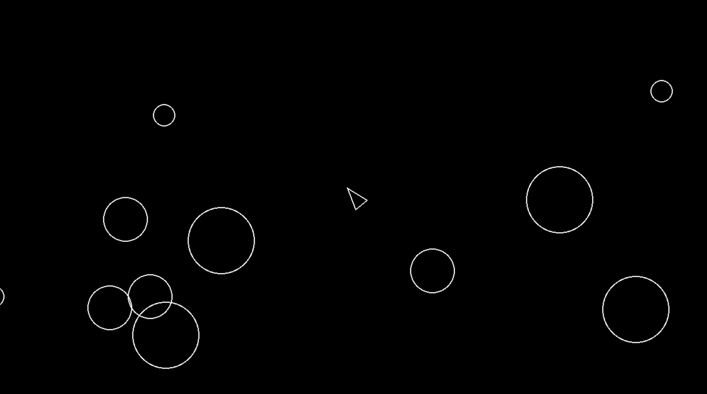

## Asteroids Game


#

This was a quick project I made using pygame to practice my skills with object oriented programming. This included topics such as: ```Classes, Objects, Inheritence, Polymorpishm, Abstraction, and Encapsulation.```

## File Strucuture
```
.
├── asteroid.py
├── asteroidfield.py
├── circleshape.py
├── constants.py
├── game_events.jsonl
├── game_state.jsonl
├── logger.py
├── main.py
├── player.py
├── pyproject.toml
├── README.md
├── shot.py
└── uv.lock
```

## Installation

```
$ git clone https://github.com/andrefetch/Asteroids.git
```
